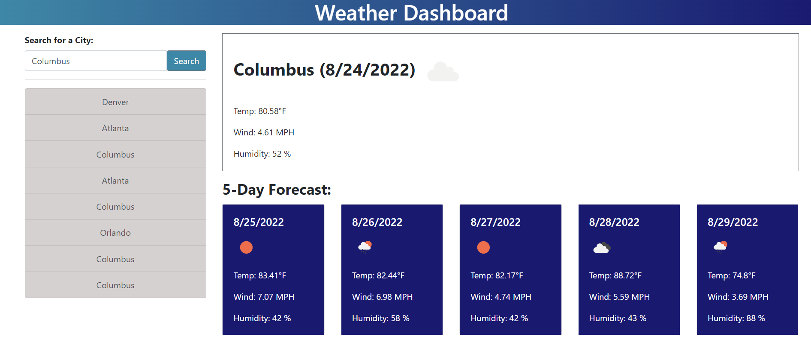

# Weather-Dashboard-App

## Description

This is a simple weather app dashboard that can populate weather information based on any city submitted. The app will show the current date and weather data and will display a 5-day forecast with similar data. All this data is retrieved using an api with Open Weather's API. All searches are saved in the side bar of the program screen.

## Table of Contents

- [Development](#development)
- [Installation](#installation)
- [Usage](#usage)
- [License](#license)

## Development

1. I first needed to figure out how I was going to populate the information on the screen. I used bootstrap to create a similar layout to the mockup.
2. I then needed to use the api to do two fetchs for the current and forecast data. 
3. Once I got the fetchs working I had to store the data and then display it on the program.
4. I then needed to save the the data into the search buttons which needed to be active so they could run the getWeather function. I solved this by creating a click event for each button manually, but know there is probably a better way to do this in the future.

## Installation

To install this project, download the files from my repository at https://github.com/AndrewKamSki/Weather-Dashboard-App. From there you can load in the html file in your favorite IDE along with the corresponding CSS and JS files. To see what the file looks like in a browser, open the index.html file in your browser.

## Usage

To use this tool for yourself, visit the depoloyed landing page at https://andrewkamski.github.io/Weather-Dashboard-App/

Upon opening, you can add text to the different text areas in the doc. To save the text to local storage, click the corresponding save button directly to the right of the text you want to save.

If you reload the page, the information should still display!

## License
MIT License

Copyright (c) [2022] [Andrew Kaminski]

Permission is hereby granted, free of charge, to any person obtaining a copy
of this software and associated documentation files (the "Software"), to deal
in the Software without restriction, including without limitation the rights
to use, copy, modify, merge, publish, distribute, sublicense, and/or sell
copies of the Software, and to permit persons to whom the Software is
furnished to do so, subject to the following conditions:

The above copyright notice and this permission notice shall be included in all
copies or substantial portions of the Software.

THE SOFTWARE IS PROVIDED "AS IS", WITHOUT WARRANTY OF ANY KIND, EXPRESS OR
IMPLIED, INCLUDING BUT NOT LIMITED TO THE WARRANTIES OF MERCHANTABILITY,
FITNESS FOR A PARTICULAR PURPOSE AND NONINFRINGEMENT. IN NO EVENT SHALL THE
AUTHORS OR COPYRIGHT HOLDERS BE LIABLE FOR ANY CLAIM, DAMAGES OR OTHER
LIABILITY, WHETHER IN AN ACTION OF CONTRACT, TORT OR OTHERWISE, ARISING FROM,
OUT OF OR IN CONNECTION WITH THE SOFTWARE OR THE USE OR OTHER DEALINGS IN THE
SOFTWARE.
